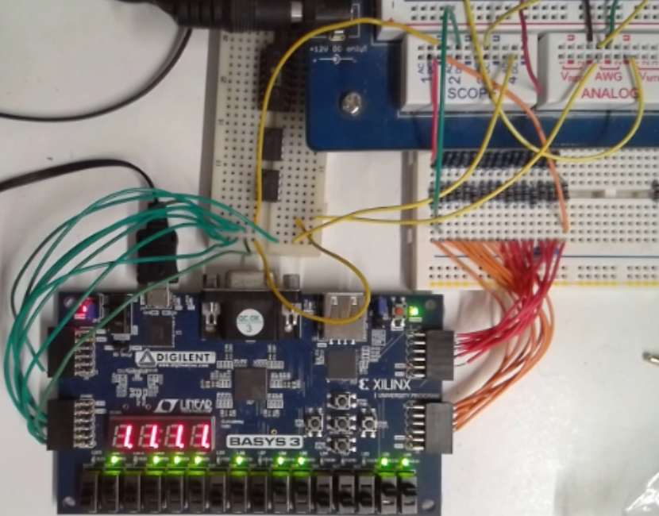
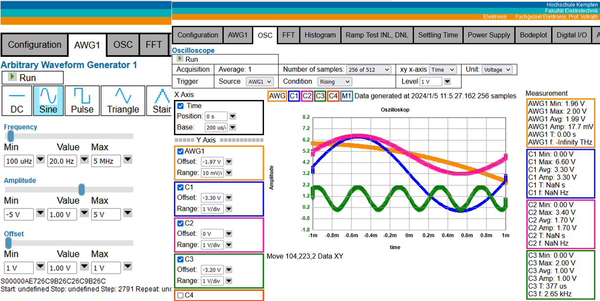

# NodeEEBench

This project implements an oscilloscope, arbitrary waveform generator, power supply and digital IOs with a 
browser interface on different hardware platforms using JavaScript and NodeJS.
So far a BASYS3 board, Arduino Maker WIFI 1010 and a RaspberryPi Zero with Digilent AD2, DA2 PMODs are the target hardware systems.

Subdirectory Xilinx contains the bit file and all sources for the BASYS3 Board.
Subdirectory Arduino contains sketches for Arduino Maker WiFi 1010 and R2R DAC and Serial C DAC.

After configuration of the hardware (FPGA, Arduino) a node server on a Windows PC can be started using 
   NodeEEBench.bat for Digilent BASYS3 board
   StartServerAx.bat for Arduino board

More documentation can be found at:
BASYS3 FPGA: [2023 Research Summary] 
(https://personalpages.hs-kempten.de/~vollratj/Projekte/2023_ResearchSummary.html).

Arduino: [2023 Interface Electronics Laboratory DAC Investigation] 
(https://personalpages.hs-kempten.de/~vollratj/InEl/2023_Lab_MKRWIFI1010_R2R.html)

